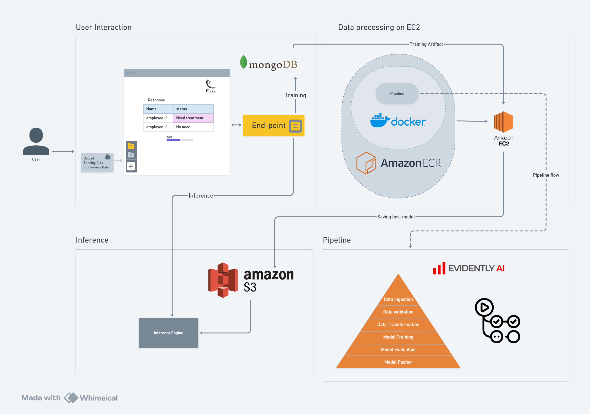

# Mental Health Assesment

The "Mental Health Assesment" project leverages machine learning and MLOps techniques to detect, analyze, and address mental health challenges within workplace environments. This system is designed to provide early warnings for potential mental health issues, analyze contributing factors, and suggest personalized interventions to promote a healthier work environment.

This project is also aimed at career optimization, highlighting the integration of modern data science practices with real-world mental health challenges in a professional setting.

## Project Architecture

The project follows an MLOps pipeline with six essential steps:

**Data Ingestion:** The data is collected and ingested from a MongoDB database, serving as the primary source for training.

**Data Validation:** Data validation is performed using the MLOps tool, Evidently, to monitor data drift and ensure the dataset's consistency and reliability.

**Data Transformation:** Data preprocessing steps are applied to clean and prepare the data for model training, including handling missing values, feature scaling, and encoding.

**Model Training:** Machine learning models are trained using various algorithms to detect signs of mental health issues based on the input features.

**Model Evaluation:** Models are evaluated based on performance metrics, with the F1 score as the primary measure to ensure balance between precision and recall.

**Model Pusher:** The best-performing model (based on the highest F1 score) is automatically deployed to an AWS S3 bucket for further use.

## MLOps Pipeline

The project employs an MLOps pipeline for continuous integration and deployment (CI/CD), ensuring the workflow is efficient, scalable, and reliable. The key components of the pipeline are:

* **Data Ingestion:** MongoDB is used to extract data for the assessment model.
* **Evidently:** Used for detecting data drift and validating data quality.
* **AWS S3:** The deployment destination for the final model.
* **AWS ECR:** Used to store, manage, and deploy Docker container images.
* **AWS EC2:**  Used the ecosytem for deployment and model processing computational resource.
* **GitHub Actions:** automates tasks like testing, building, and deploying code directly in your GitHub repository.

## Workflow



## Project Layout

```
    ├── .gitignore
    ├── Dockerfile
    ├── LICENSE
    ├── Mental_Health/
    │   ├── __init__.py
    │   ├── cloud_storage/
    │   │   ├── __init__.py
    │   │   └── aws_storage.py
    │   ├── components/
    │   │   ├── __init__.py
    │   │   ├── data_ingestion.py
    │   │   ├── data_transformation.py
    │   │   ├── data_validation.py
    │   │   ├── model_evaluation.py
    │   │   ├── model_pusher.py
    │   │   └── model_trainer.py
    │   ├── configuration/
    │   │   ├── __init__.py
    │   │   ├── aws_connection.py
    │   │   ├── mongodb_connection.py
    │   │   └── progressbar.py
    │   ├── constants/
    │   │   ├── __init__.py
    │   ├── data_access/
    │   │   ├── __init__.py
    │   │   └── mentalhealth_data.py
    │   ├── entity/
    │   │   ├── __init__.py
    │   │   ├── artifact_entity.py
    │   │   ├── config_entity.py
    │   │   ├── estimator.py
    │   │   └── s3_estimator.py
    │   ├── exception/
    │   │   ├── __init__.py
    │   ├── logger/
    │   │   ├── __init__.py
    │   ├── pipeline/
    │   │   ├── __init__.py
    │   │   ├── prediction_pipeline.py
    │   │   └── training_pipeline.py
    │   └── utils/
    │       ├── __init__.py
    │       └── main_utils.py
    ├── Notebook/
    │   ├── Data_drift_demo_evidentlt.ipynb
    │   ├── EDA_Mental_Health.ipynb
    │   ├── Feature_Engineering_training.ipynb
    │   ├── demo_null_hamdler.ipynb
    │   ├── mongodb_demo.ipynb
    │   └── test.ipynb
    ├── README.md
    ├── app.py
    ├── artifact/
    │   └── 09_17_2024_23_59_45/
    │       ├── data_ingestion/
    │       │   ├── data_ingestion/
    │       │   │   ├── test.csv
    │       │   │   └── train.csv
    │       │   └── feature_store/
    │       │       └── survey.csv
    │       ├── data_transformation/
    │       │   ├── transformed/
    │       │   │   ├── test.npy
    │       │   │   └── train.npy
    │       │   └── transformed_object/
    │       │       └── Processing.pkl
    │       ├── data_validation/
    │       │   └── drift_report/
    │       │       └── report.yaml
    │       └── model_trainer/
    │           └── trained_model/
    │               └── model.pkl
    ├── config/
    │   ├── model.yaml
    │   └── schema.yaml
    ├── demo.py
    ├── requirements.txt
    ├── setup.py
    ├── template.py
    └── templates/
        └── mentalhealth.html

```

# AWS EC2 and ECR Deployment Guide

This guide provides a step-by-step process for deploying your application using AWS resources such as EC2 (Elastic Compute Cloud) and ECR (Elastic Container Registry). This setup is ideal for Docker-based applications that need to be stored in a container registry and deployed on virtual AWS infrastructure.

---

## Reproducibility Steps

### Step 0: Set Up Python Environment

1. **Create Virtual Environment** (Optional but Recommended):

   - It’s recommended to work within a virtual environment to isolate your project’s dependencies. If you're using `venv`, run the following command:
     ```bash
     python -m venv env --python=3.10
     ```
   - If you're using `conda`, create a new environment:
     ```bash
     conda create --name env python=3.10
     ```

2. **Activate the Environment**:

   - For `venv`:
     ```bash
     source env/bin/activate
     ```
   - For `conda`:
     ```bash
     conda activate env
     ```

### Step 1: Install Dependencies

1. **Install pip (if not already installed)**:

   - If you haven't installed `pip`, follow [these instructions](https://pip.pypa.io/en/stable/installation/).

2. **Install Requirements**:

   - Navigate to the root directory of your project where `requirements.txt` is located.
   - Run the following command to install the required packages:
     ```bash
     pip install -r requirements.txt
     ```

### Step 2: Create an ECR Repository

1. Create an ECR repository to save your Docker image.


### Step 3: Build and Push the Docker Image to ECR

1. **Build your Docker image locally**:

    ```bash
    docker build -t visarepo .
    ```

2. **Authenticate Docker to your ECR**:

    ```bash
    aws ecr get-login-password --region {region} | docker login --username AWS --password-stdin {conatiner_registery}
    ```

3. **Tag your Docker image**:

    ```bash
    docker tag visarepo:latest {image}
    ```

4. **Push the Docker image to ECR**:

    ```bash
    docker push {image}
    ```

---

### Step 4: Create an EC2 Instance

1. Launch an EC2 instance (Ubuntu recommended).
2. Ensure security groups are configured to allow necessary ports (e.g., 80, 443 for HTTP/HTTPS).
3. Save the public IP address or DNS for SSH access and remote management.

---

### Step 5: Install Docker on the EC2 Instance

1. **Connect to your EC2 instance via SSH** and run the following commands to set up Docker:

2. **Optional**: Update and upgrade the EC2 instance:

    ```bash
    sudo apt-get update -y
    sudo apt-get upgrade -y
    ```

3. **Required**: Install Docker:

    ```bash
    curl -fsSL https://get.docker.com -o get-docker.sh
    sudo sh get-docker.sh
    ```

4. **Add Permissions for Docker**:

    ```bash
    sudo usermod -aG docker ubuntu
    newgrp docker
    ```

---

### Step 6: Pull and Launch the Docker Image on EC2

1. **Log in to ECR from your EC2 instance**:

    ```bash
    aws ecr get-login-password --region {region} | docker login --username AWS --password-stdin {conatiner_registery}
    ```

2. **Pull your Docker image**:

    ```bash
    docker pull {image}
    ```

3. **Run your Docker container**:

    ```bash
    docker run -d -p 80:80 {image}
    ```

---

## IAM Policies Needed for Deployment

Ensure the following IAM policies are attached to the AWS user or role handling the deployment:

- **AmazonEC2ContainerRegistryFullAccess**: Allows full access to ECR for managing container images.
- **AmazonEC2FullAccess**: Grants full access to EC2 for instance management.

---

## Training, Hyperparameter Tuning, and Deployment

This section outlines the training, hyperparameter tuning, and deployment processes, including configuration files and model storage.

---

### Model Configuration

1. **Model Hyperparameter Configuration** (`config/model.yaml`): This YAML file specifies the hyperparameter grids for tuning each classifier. The classifiers include:
   - **GradientBoostingClassifier**
   - **AdaBoostClassifier**
   - **XGBClassifier**

   These configurations are utilized in the hyperparameter tuning phase to systematically search for the best model parameters.

2. **Data Schema** (`config/schema.yaml`): Defines the data structure, including:
   - **Required Fields**: Specifies mandatory input fields.
   - **Categorical Features**: Lists categorical features for encoding.
   - **Numerical Features**: Lists numerical features for scaling or normalization.

---

### Hyperparameter Tuning with GridSearchCV

Using `GridSearchCV`, each model is fine-tuned across parameter grids defined in `model.yaml`. This process identifies the optimal hyperparameters for each model, ensuring high performance on the validation set.

---

### Model Evaluation and Selection

After hyperparameter tuning, the best-performing model is selected based on evaluation metrics such as accuracy, F1 score, or AUC. The selected model undergoes final testing on a separate validation dataset to confirm robustness.

---

### Model Storage on Amazon S3

Upon successful evaluation, the finalized model is saved to an Amazon S3 bucket for persistent storage. This enables easy retrieval and deployment in production. The storage process includes:

1. **Serialization**: The model is serialized into a format compatible with your inference pipeline (e.g., `.pkl` or `.joblib`).
2. **Upload to S3**: The serialized model is uploaded to a designated S3 bucket, ensuring accessibility for deployment and future updates.

---

### Deployment Configuration

Set up AWS credentials and specify the target S3 bucket in your configuration for seamless model uploading. The uploaded model is now ready for use in production, and you can fetch it directly from Amazon S3 when deploying to a cloud environment or local server.

---

This pipeline ensures a robust, reproducible model training and deployment process with storage on Amazon S3, facilitating easy retrieval and scalable deployment.


## GitHub Secrets Configuration

To securely manage AWS credentials and configurations for GitHub Actions, set the following secrets in your GitHub repository settings:

- `AWS_ACCESS_KEY_ID`: Your AWS access key ID.
- `AWS_SECRET_ACCESS_KEY`: Your AWS secret access key.
- `AWS_DEFAULT_REGION`: AWS region, e.g., `us-east-1`.
- `ECR_REPO`: Your ECR repository URI, e.g., `417864495354.dkr.ecr.us-east-1.amazonaws.com/healthrepo`.

---

## License

This project is licensed under the [MIT License](https://choosealicense.com/licenses/mit/).
